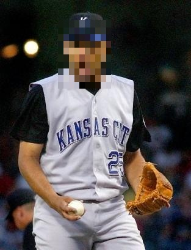

# Face Blur Privacy Tool

## Overview
This project is a Python application that automatically detects and blurs faces in images to protect individual privacy. The program uses computer vision techniques to locate faces in an image and applies a blur filter to obscure those regions while leaving the rest of the image unchanged.

Face blurring is commonly used in journalism, surveillance footage, and public datasets to protect identities. This project demonstrates how automated anonymization can be implemented using Python and OpenCV.

---

## Technologies Used

- Python
- OpenCV
- NumPy
- Haar Cascade face detection model

---

## How It Works

The application follows a simple computer vision workflow:

1. Load the input image.
2. Convert the image to grayscale.
3. Use a pretrained face detection model to locate faces.
4. Draw bounding boxes around detected faces.
5. Apply a blur filter to each detected face region.
6. Save the processed image with blurred faces.

---

## Example

Original Image

Blurred Result

---

## Project Structure

face-blur-app

│

├── face_blur_app.py

├── ml_models/

├── test_images/

├── output_images/

├── .gitignore

└── README.md

---

## Installation

Clone the repository:

git clone https://github.com/midavis64/face_blur_app.git
cd face_blur_app

___

Install dependencies:

pip install opencv-python numpy

---

## Running the Program

Run the application with:

python face_blur_app.py

The script will process images and save the blurred results to the output directory.

---

## Limitations

During testing, several limitations were observed:

- The Haar Cascade model works best on **frontal faces**.
- Side profiles may not always be detected.
- Certain objects with face-like patterns can trigger **false positives**.
- Lighting and image resolution can impact detection accuracy.

---

## Future Improvements

Potential improvements to the project include:

- Implementing a deep learning face detector such as **YOLO or OpenCV DNN**.
- Supporting **real-time video face blurring**.
- Adding adaptive blur strength for different image resolutions.
- Improving detection of **side-profile faces**.

---

## Author

Matthew Davis  
Computer Science Graduate  
Interested in Data Science, Computer Vision, and Machine Learning

